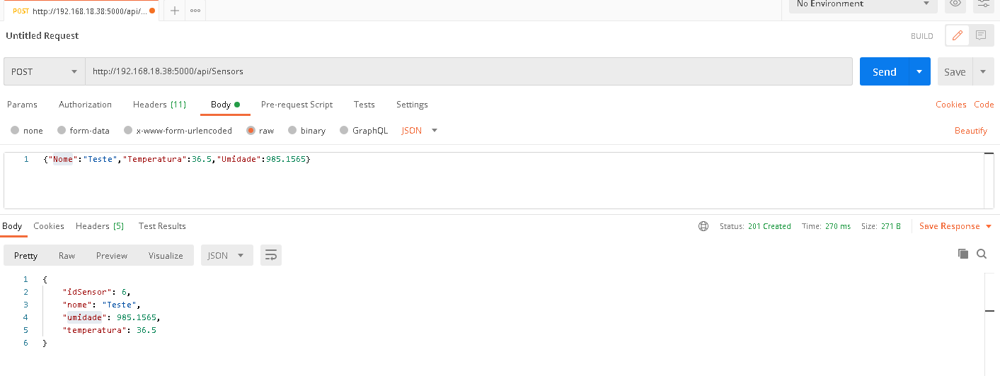

# HomeHot

### Serviço Para Receber e Apresentar Dados em C#,ASPCore,SQLServer

#### Acesso WEB

#### Acesso API

#### Acesso Mobile

### Cliente Sersor DHT11 com ESP01 rodando ARDUINO/C++,enviando dados via post no formado Json

### Analise de Dados Usando Python com pandas e matplotlib

